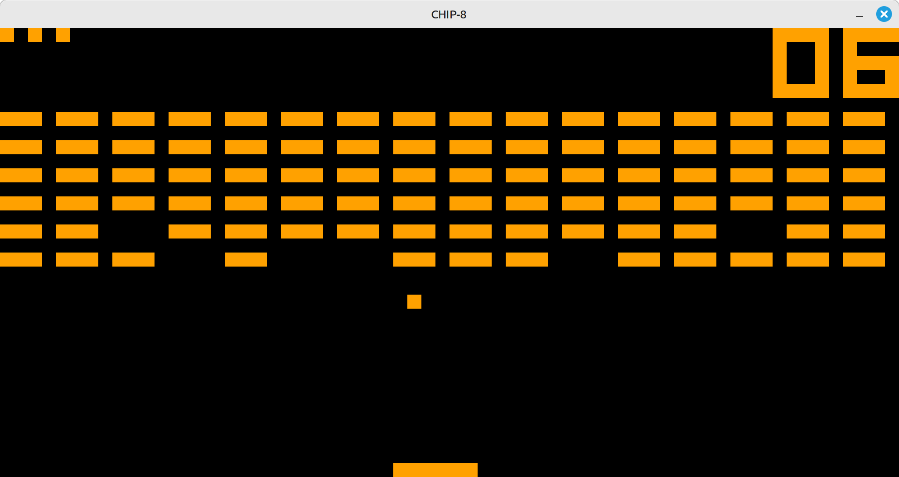

# chip8

[CHIP-8][wikipedia-chip-8] emulator written in [Zig][zig].

I built this as my [December Adventure][adventure] in December 2024 to learn Zig and get a bit of
experience with low-level programming. It’s pretty basic, but it does load and run CHIP-8 programs.

The project includes three Zig programs:

    main.zig is the main emulator
    bin.zig  transforms hexadecimal programs into binary ones
    hex.zig  transforms binary programs into hexadecimal ones

The only dependencies are Zig and [raylib][raylib]. Build it with

    zig build

The file [cafe.hex](cafe.hex) contains a Hello, World! type program. You can run it with:

    zig run bin.zig -- cafe.hex CAFE
    ./zig-out/bin/chip8 CAFE

For more CHIP-8 programs, take a look at
[github.com/JamesGriffin/CHIP-8-Emulator/tree/master/roms][james-griffin-roms] or
[github.com/dmatlack/chip8/tree/master/roms][dmatlack-roms]. The screenshot at the top is the BRIX
[game available from both.

[wikipedia-chip-8]: https://en.m.wikipedia.org/wiki/CHIP-8
[zig]: https://ziglang.org/
[adventure]: https://levin405.neocities.org/december2024/
[raylib]: https://www.raylib.com/
[james-griffin-roms]: https://github.com/JamesGriffin/CHIP-8-Emulator/tree/master/roms
[dmatlack-roms]: https://github.com/dmatlack/chip8/tree/master/roms
